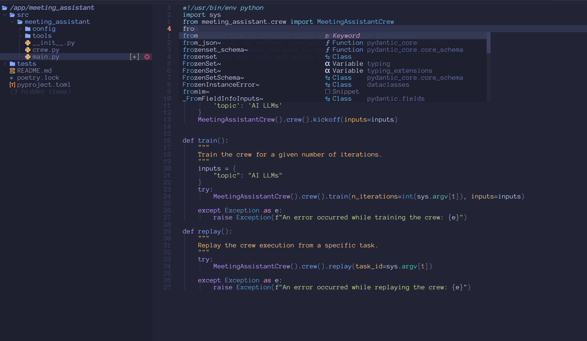

# CrewAI Agents Docker Image

- [Motivation](#motivation)
- [Prerequisites](#prerequisites)
- [Installation](#installation)
- [Usage](#usage)
- [Tools](#tools)
- [Supported Versions](#versions)
- [Tips](#tips)
- [Example Projects](#examples)
- [Screen Captures](#screencaptures)
- [Issues](#issues)
- [License](#license)

## Motivation

This Docker image provides a convenient & secure way to create and run CrewAI agents without having to install any dependencies locally. I created the image to experiment with [ollama](https://ollama.com/) code generation and execution.

## Prerequisites

- Docker
- Basic knowledge of python
- Basic knowledge of crewAI
- Ollama installed locally or access to remote AI services like chatGPT
- Desire to learn and have fun

## Usage
### Starting the container

 Run the following command after replacing `container_name` with the name of your container, `project_name` with the name of your project and `tag` with the [tag](https://hub.docker.com/r/sageil/crewai/tags) of the image you want to use.

```bash
docker run -it --network host --name <container_name> -e P=<project_name> sageil/crewai:<tag> bash
```

> [!TIP]
> if you leave out the `P` completely `-e P=<project_name>` from the command, a default crew will be created with the name default_crew.

#### Method 1: using a ollama locally

1. Changing the container local configuration.
    - Type `v .` to open neovim
    - Open Lazyvim Explorer using `SPACE+e`
    - Show hidden files using `SHIFT+H`
    - Change the model and the `API_BASE` to `http://host.docker.internal:11434` and `MODEL` a model you have pulled on llama.
2. Running your crew
    - Open lazyvim terminal using `CTRL+/`
    - Run `crewai run`


#### Method 2: using remote services like chatGPT


1. Change your selected provider and model:
    - Type `v .` to open neovim
    - Open Lazyvim Explorer using `SPACE+e`
    - Show hidden files using `SHIFT+H`
    - Change the model and the `OPENAI_API_KEY` to your key and `MODEL` a model you wish to use.
2. Running your crew
    - Open lazyvim terminal using `CTRL+/`
    - Run `crewai run`

#### Changing model and provider using Code

1. Open your crew's crew.py
2. Add `from crewai.llm import LLM` to the imports
3. In your crew's `CrewBase` class create your LLM

```python
 myllm = LLM (
        model='ollama/deepseek-r1:7b',
        base_url="http://localhost:11434",
        temperature=0.2)
    )
```
4. Assign the LLM to your agent by assigning it to the `llm` property

```python
    @agent
    def researcher(self) -> Agent:
        return Agent(
            config=self.agents_config['researcher'],
            # tools=[MyCustomTool()], # Example of custom tool, loaded on the beginning of file
            verbose=True, # Print out all actions
            llm=self.myllm
        )

```

> [!TIP]
> When working with remote services, you can also remove the --network host part of the command as its only required to allow
> the container access to the host's network.


## Tools

- **neoVim** Latest stable version built from source [neovim](https://github.com/neovim/neovim)
- **uv** Dependency management tool for Python projects [uv](https://github.com/astral-sh/uv/)
- **lazyVim** A highly optimized Vim-like editor for Neovim [lazyvim](https://www.lazyvim.org/)
- **crewAI** Platform for Multi AI Agents Systems [official CrewAI documentation](https://docs.crewai.com/)

## Versions

[Available Versions](https://hub.docker.com/r/sageil/crewai/tags)


- **crewAI** 0.102.0 **crewai-tools** 0.36.0
- **crewAI** 0.100.0 **crewai-tools** 0.33.0
- **crewAI** 0.98.0 **crewai-tools** 0.32.1
- **crewAI** 0.95.0 **crewai-tools** 0.25.8
- **crewAI** 0.85.0 **crewai-tools** 0.17.9
- **crewAI** 0.85.0 **crewai-tools** 0.17.0
- **crewAI** 0.83.0 **crewai-tools** 0.14.0
- **crewAI** 0.80.0 **crewai-tools** 0.14.0
- **crewAI** 0.79.4 **crewai-tools** 0.14.0
- **crewAI** 0.76.9 **crewai-tools** 0.13.4
- **crewAI** 0.76.2 **crewai-tools** 0.13.2
- ~~**crewAI** 0.74.1 **crewai-tools** 0.13.2~~
- ~~**crewAI** 0.70.1 **crewai-tools** 0.12.1~~
- ~~**crewAI** 0.65.2 **crewai-tools** 0.12.1~~
- ~~**crewAI** 0.64.0 **crewai-tools** 0.12.1~~
- ~~**crewAI** 0.61.0 **crewai-tools** 0.12.1~~
- ~~**crewAI** 0.55.2 **crewai-tools** 0.8.3~~
- ~~**crewAI** 0.51.0 **crewai-tools** 0.8.3~~
- ~~**crewAI** 0.41.1 **crewai-tools** 0.4.26~~
- ~~**crewAI** 0.36.0 && **crewai-tools** 0.4.26~~

## Tips

- v: `alias v='nvim` & `alias vim='nvim'`
- Running `newcrew <project_name>` will create a new crew project with the provided name, install dependencies and configure the project virtual environment.
- You can restart a container after stopping it by using `docker container start -ai <container_name>`

## Example

[Veterinary Assistant Crew](https://github.com/sageil/veterinary_assistant)

## ScreenCaptures




## Issues

Known issues:

1. Copying from nvim fails due to display driver
2. Icon fonts are not rendered correctly in the container's terminal? [Watch](https://www.youtube.com/watch?v=mQdB_kHyZn8). if the video peaked your interest in [Wezterm](https://wezfurlong.org/wezterm/index.html), you can use my configuration from [Wezterm configs](https://github.com/sageil/wezterm)

New Issues:

Please report other issues you encounter on the [Issues](https://github.com/sageil/crewai-docker-image/issues) including steps to reproduce them.

## License

This project is licensed under the [MIT License](https://github.com/sageil/crewai-docker-image/blob/main/LICENSE.md).
