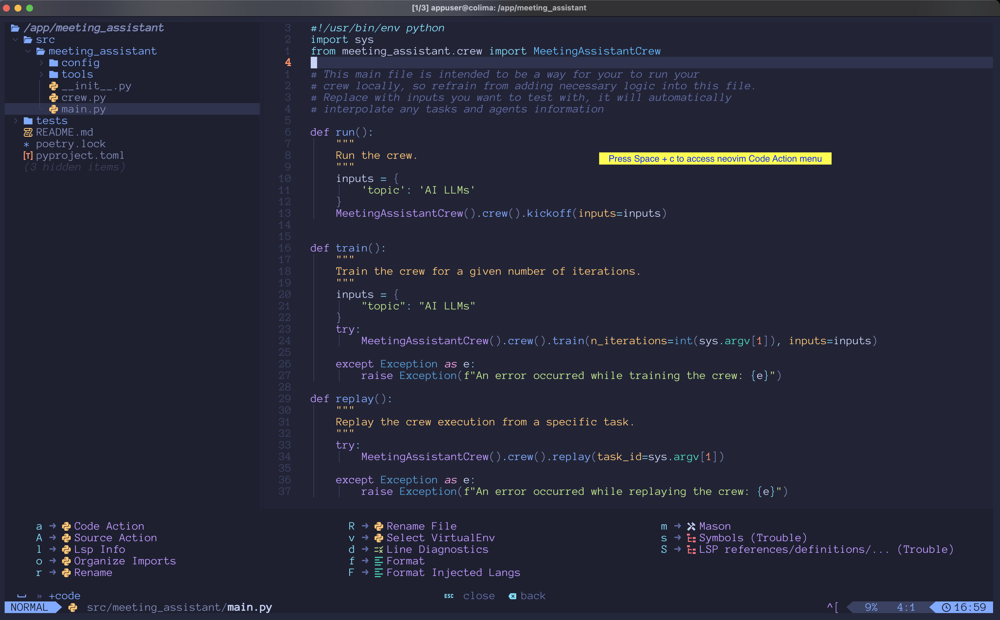

# CrewAI Agents Docker Image

- [Motivation](#motivation)
- [Prerequisites](#prerequisites)
- [Installation](#installation)
- [Usage](#usage)
- [Tools](#tools)
- [Supported Versions](#versions)
- [Tips](#tips)
- [Example Projects](#examples)
- [Screen Captures](#screencaptures)
- [Issues](#issues)
- [License](#license)

## Motivation

This Docker image provides a convenient & secure way to create and run CrewAI agents without having to install any dependencies locally. I created the image to experiment with [ollama](https://ollama.com/) code generation and execution.

## Prerequisites

- Docker
- Basic knowledge of python
- Basic knowledge of crewAI and langchain
- Ollama installed locally or access to remote AI services like chatGPT
- Desire to learn and have fun

## Usage

#### Method 1: using a ollama locally

1. Run the following command after replacing `container-name` with the name of your container, `project-name` with the name of your project and `tag` with the [tag](https://hub.docker.com/r/sageil/crewai/tags) of the image you want to use.

```bash
docker run -it --network host --name <container-name> -e P=<project-name> sageil/crewai:<tag> bash
```

> [!TIP]
> if you leave out the `P` completely `-e P=<project_name>` from the command, a default crew will be created with the name default_crew.

2. Once the container starts, from your container shell, navigate to your project directory/src/crew.py and import `Ollama` by adding `from langchain_community.llms import Ollama`
3. Configure your crew to use your local llm by adding

```python
 myllm = Ollama(model="openhermes:v2.5", base_url="http://host.docker.internal:11434", temperature=0)
```

4. Change the model and the temperature in the above snippet to your desired llm model
5. Add the llm property to your agents by adding `llm=myllm`

```python
    @agent
    def researcher(self) -> Agent:
        return Agent(
            config=self.agents_config['researcher'],
            # tools=[MyCustomTool()], # Example of custom tool, loaded on the beginning of file
            verbose=True, # Print out all actions
            llm=myllm
        )

```

6. Run your crew by executing `poetry run <project_name>`

#### Method 2: using remote services like chatGPT

1. Set your OPENAI API key `os.environ["OPENAI_API_KEY"] = "YOUR_KEY"`
2. Set your chatGPT model `os.environ["CHATGPT_MODEL"] = "YOUR_MODEL`
3. Add the llm property to your agents by adding `llm=ChatOpenAI()`
4. Run your crew by executing `poetry run <project_name>`

> [!TIP]
> When working with remote services, you can also remove the --network host part of the command as its only required to allow
> the container access to the host's network.

## Tools

- **neoVim** Latest stable version built from source [neovim](https://github.com/neovim/neovim)
- **poetry** Dependency management tool for Python projects [poetry](https://python-poetry.org/)
- **lazyVim** A highly optimized Vim-like editor for Neovim [lazyvim](https://www.lazyvim.org/)
- **crewAI** Platform for Multi AI Agents Systems [official CrewAI documentation](https://docs.crewai.com/)

## Versions

[Available Versions](https://hub.docker.com/r/sageil/crewai/tags)

- **crewAI** 0.74.1 **crewai-tools** 0.13.2
- **crewAI** 0.70.1 **crewai-tools** 0.12.1
- **crewAI** 0.65.2 **crewai-tools** 0.12.1
- **crewAI** 0.64.0 **crewai-tools** 0.12.1
- **crewAI** 0.61.0 **crewai-tools** 0.12.1
- **crewAI** 0.55.2 **crewai-tools** 0.8.3
- **crewAI** 0.51.0 **crewai-tools** 0.8.3
- **crewAI** 0.41.1 **crewai-tools** 0.4.26
- **crewAI** 0.36.0 && **crewai-tools** 0.4.26

## Tips

- v: `alias v='nvim` & `alias vim='nvim'`
- Running `newcrew <project_name>` will create a new crew project with the provided name, install dependencies and configure the project virtual environment.
- You can restart a container after stopping it by using `docker container start -ai <container-name>`

## Example

[Veterinary Assistant Crew](https://github.com/sageil/veterinary_assistant)

## ScreenCaptures




## Issues

Known issues:

1. Copying from nvim fails due to display driver
2. Icon fonts are not rendered correctly in the container's terminal? [Watch](https://www.youtube.com/watch?v=mQdB_kHyZn8). if the video peaked your interest in [Wezterm](https://wezfurlong.org/wezterm/index.html), you can use my configuration from [Wezterm configs](https://github.com/sageil/wezterm)

New Issues:

Please report other issues you encounter on the [Issues](https://github.com/sageil/crewai-docker-image/issues) including steps to reproduce them.

## License

This project is licensed under the [MIT License](https://github.com/sageil/crewai-docker-image/blob/main/LICENSE.md).
